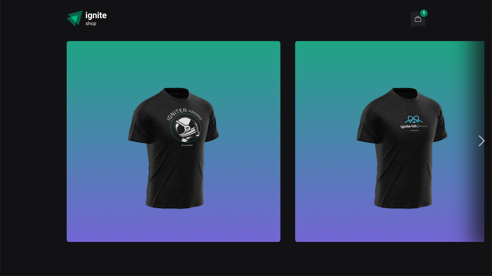

<h1 align="center">👑 Rocketseat | Ignite Shop 👑</h1>

Aplicação Front-end desenvolvida como um desafio proposto na trilha de ReactJS do Ignite da Rocketseat, com o objetivo de simular as funcionalidades básicas de um e-commerce integrado com as APIs do Stripe.

  
  

## ✔️ Tecnologias utilizadas

- ``NextJS``
- ``TypeScript``
- ``Stitches``
- ``React Toastify``
- ``Stripe``
